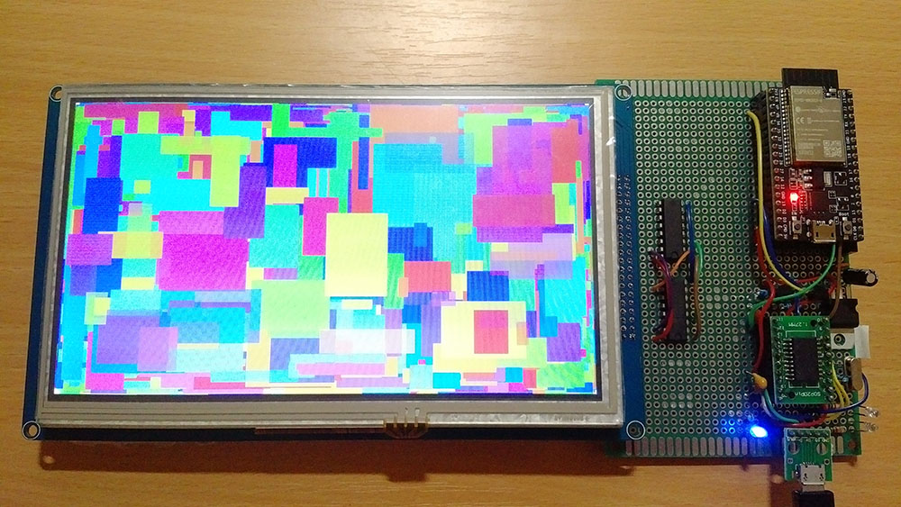
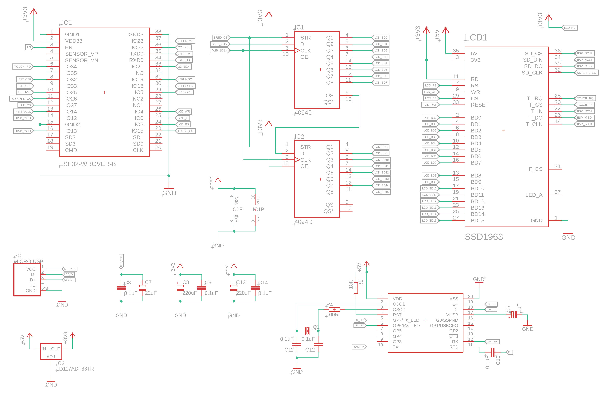

SSD1963
-------

_Warning: Work in Progress, the API may change any time!_

This is a [PlatformIO](https://platformio.org/) (Arduino compatible) library for SSD1963 TFT displays. This library also includes support for SPI based HR2046 (ADS7843 compatible) touch controller. The displays is driven by two daisy-chained [74HC4094](https://www.ti.com/lit/ds/symlink/cd74hc4094.pdf) shift registers.

## Example



*An example of examples/SSD1963Rectangles/SSD1963Rectangles.ino running on ESP32 WRover DevKitC. The example draws random rectangles in a loop, with a random hue.*

## Schematic

The following schematic was used to develop and test this library.



## Supported hardware

TODO

## Wiring

## License

```
MIT License

Copyright (c) 2020 Matus Novak

Permission is hereby granted, free of charge, to any person obtaining a copy
of this software and associated documentation files (the "Software"), to deal
in the Software without restriction, including without limitation the rights
to use, copy, modify, merge, publish, distribute, sublicense, and/or sell
copies of the Software, and to permit persons to whom the Software is
furnished to do so, subject to the following conditions:

The above copyright notice and this permission notice shall be included in all
copies or substantial portions of the Software.

THE SOFTWARE IS PROVIDED "AS IS", WITHOUT WARRANTY OF ANY KIND, EXPRESS OR
IMPLIED, INCLUDING BUT NOT LIMITED TO THE WARRANTIES OF MERCHANTABILITY,
FITNESS FOR A PARTICULAR PURPOSE AND NONINFRINGEMENT. IN NO EVENT SHALL THE
AUTHORS OR COPYRIGHT HOLDERS BE LIABLE FOR ANY CLAIM, DAMAGES OR OTHER
LIABILITY, WHETHER IN AN ACTION OF CONTRACT, TORT OR OTHERWISE, ARISING FROM,
OUT OF OR IN CONNECTION WITH THE SOFTWARE OR THE USE OR OTHER DEALINGS IN THE
SOFTWARE.
```
